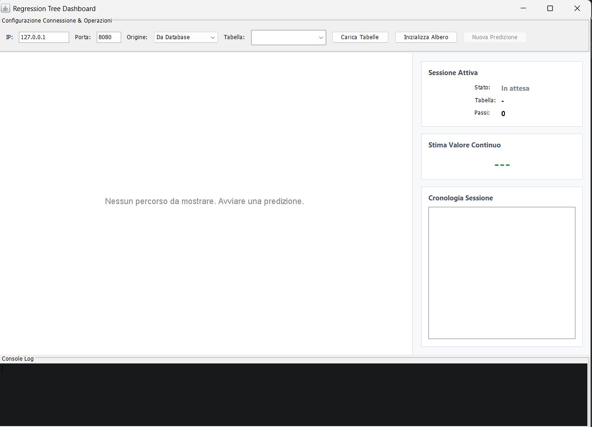
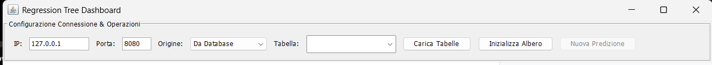
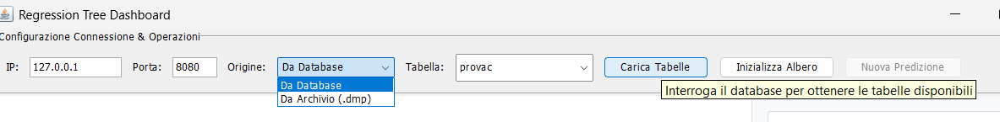
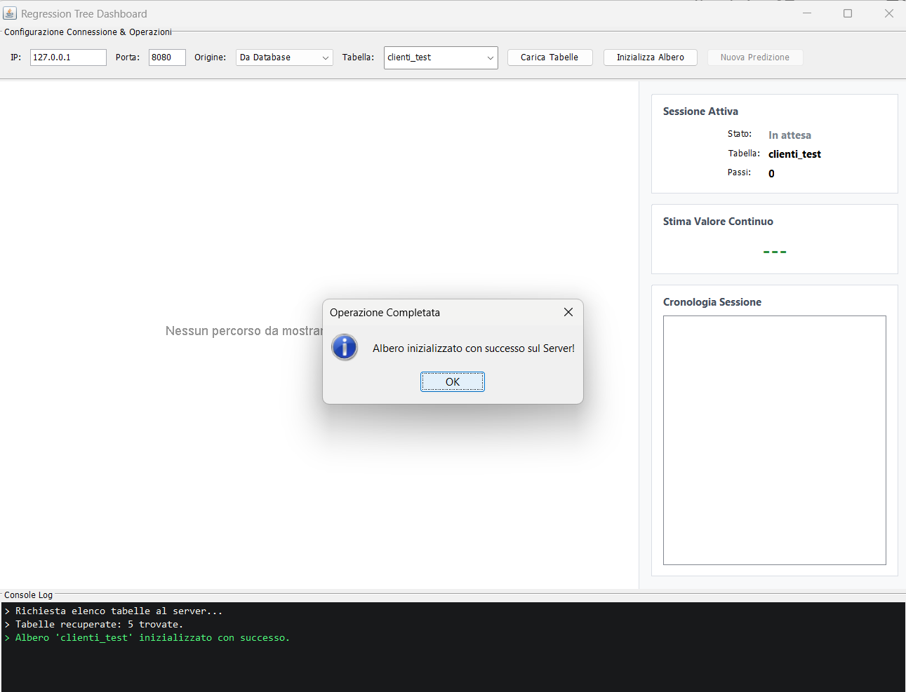
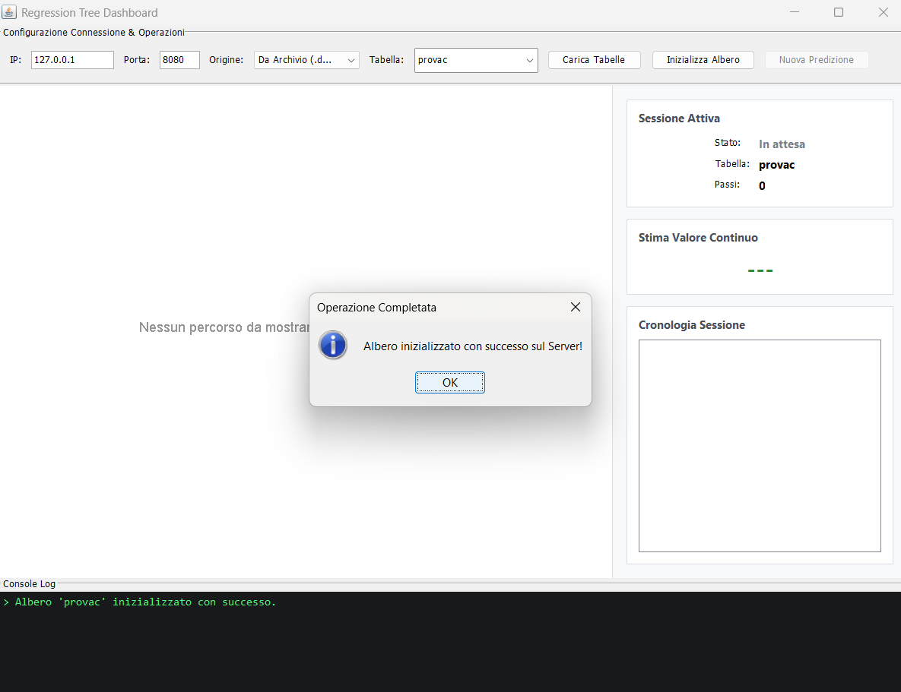
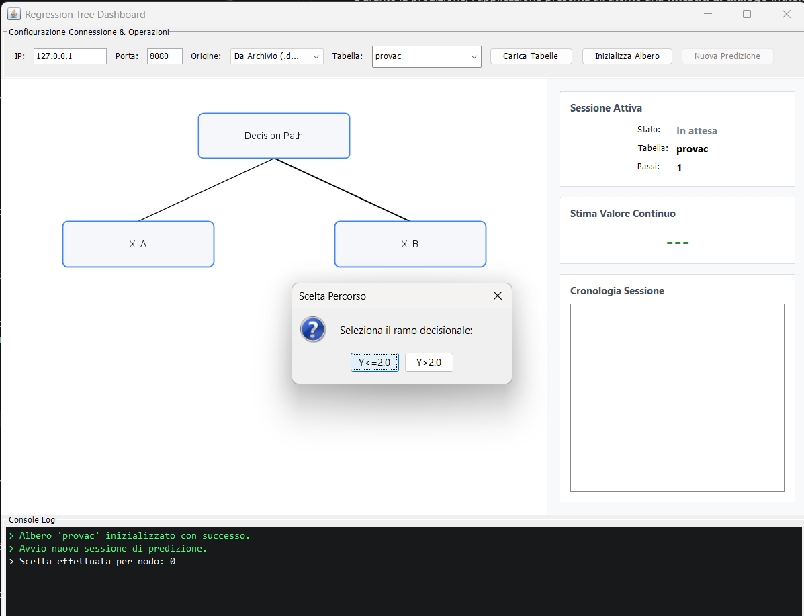
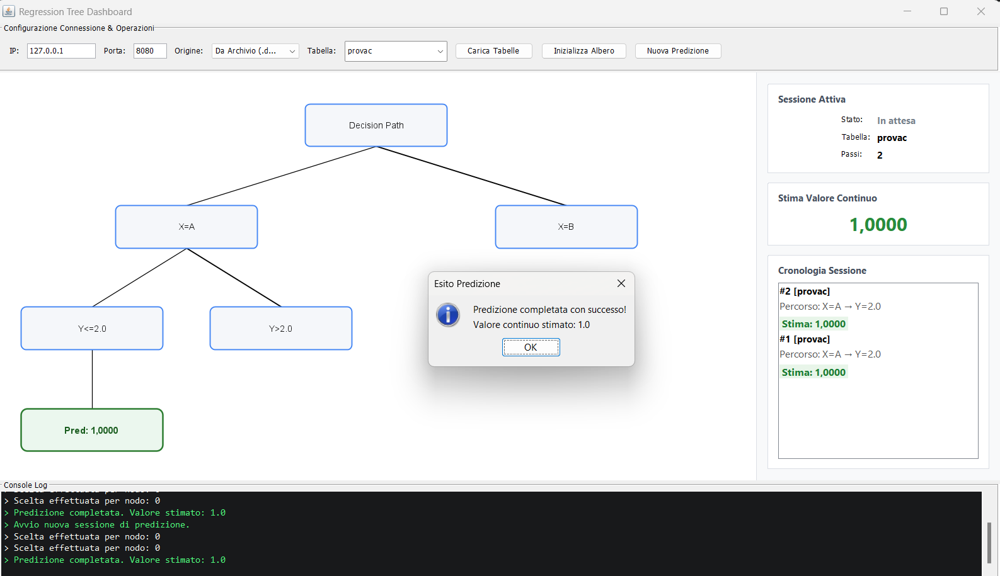
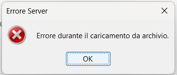
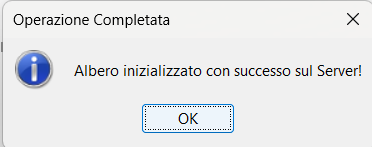
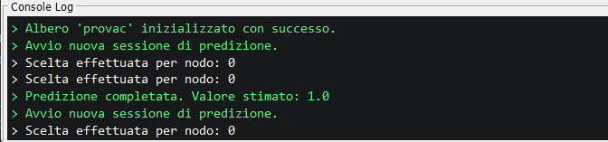

# Guida Utente — MapClient

## 1. Introduzione

MapClient è il componente frontend del sistema per la generazione e l'interrogazione di alberi di
regressione. Il client si connette al server remoto attraverso la rete e permette di interagire tramite un'interfaccia grafica.

L'applicazione consente di:

- **Costruire** un albero di regressione a partire dai dati memorizzati in un database relazionale;
- **Caricare** alberi di regressione precedentemente salvati sul server in un file .dmp
- **Eseguire predizioni interattive**, navigando i rami dell'albero e rispondendo alle domande proposte dal sistema, fino a ottenere una stima del valore target continuo.

L'interfaccia principale è organizzata in quattro aree funzionali all'interno della finestra **"Regression Tree Dashboard"**:

| Area | Descrizione |
|------|-------------|
| **Pannello di Controllo** | Configurazione della connessione, selezione della provenienza dei dati e pulsanti per le operazioni principali |
| **Pannello Albero** | Visualizzazione grafica del percorso decisionale durante la predizione |
| **Pannello Riepilogo** | Informazioni sulla sessione attiva, valore stimato e cronologia delle predizioni |
| **Console Log** | Registro cronologico delle operazioni e dei messaggi di sistema |

### Flusso di Lavoro Complessivo

Il flusso operativo tipico segue queste fasi:

1. **Avvio** dell'applicazione;
2. **Configurazione** dei parametri di connessione al server (indirizzo IP e porta);
3. **Scelta della fonte dati** (database o archivio);
4. **Caricamento dell'albero** (apprendimento da database o caricamento da archivio);
5. **Esecuzione della predizione** attraverso la navigazione interattiva dell'albero;
6. **Consultazione del risultato** e, se necessario, ripetizione della predizione.



---

## 2. Requisiti di Sistema e Avvio

### Requisiti

- **Java Runtime Environment (JRE)** versione **21** o superiore deve essere installato sul sistema operativo in uso.


### Modalità di Avvio

L'avvio dell'applicazione può essere effettuato in uno dei seguenti modi:

**Tramite script di avvio per Windows(consigliato):**

Nella directory di installazione, eseguire il file `EseguiClient.bat` (Windows). Lo script avvia automaticamente l'applicazione con i parametri predefiniti.

**Tramite riga di comando:**

Aprire un terminale, posizionarsi nella directory contenente il file `.jar` dell'applicazione e digitare:

```
java -jar MapClient.jar
```

### Parametri di Connessione

All'avvio, l'applicazione presenta i parametri di connessione predefiniti, modificabili direttamente dall'interfaccia grafica:

| Parametro | Valore Predefinito | Descrizione |
|-----------|-------------------|-------------|
| **Indirizzo IP** | `127.0.0.1` | Indirizzo del server a cui connettersi |
| **Porta** | `8080` | Numero di porta del server |

Per connettersi a un server remoto, sostituire `127.0.0.1` (indirizzo locale) con l'indirizzo IP o il nome host del server desiderato e, se necessario, modificare il numero di porta.

La connessione al server **non viene stabilita automaticamente**: viene effettuata al primo comando dell'utente (caricamento dell'elenco tabelle o inizializzazione dell'albero).


## 4. Guida all'Interfaccia e Operazioni Principali

### 4.1 Pannello di Controllo e Configurazione

Il pannello di controllo, posizionato nella parte superiore della finestra, è contenuto in un riquadro intitolato **"Configurazione Connessione & Operazioni"** e comprende i seguenti elementi:

| Elemento | Tipo | Descrizione |
|----------|------|-------------|
| **IP** | Campo di testo | Indirizzo del server (valore predefinito: `127.0.0.1`) |
| **Porta** | Campo di testo | Numero di porta del server (valore predefinito: `8080`) |
| **Origine** | Menu a tendina | Sorgente dei dati: **"Da Database"** o **"Da Archivio (.dmp)"** |
| **Tabella** | Menu a tendina / Campo di testo | Nome della tabella del database o del file di archivio da caricare |
| **Carica Tabelle** | Bottone | Interroga il server per ottenere l'elenco delle tabelle disponibili nel database |
| **Inizializza Albero** | Bottone | Avvia la costruzione o il caricamento dell'albero di regressione |
| **Nuova Predizione** | Bottone | Avvia una sessione interattiva di predizione (disponibile solo dopo l'inizializzazione) |




#### Scelta della Fonte Dati

Il menu a tendina **"Origine"** consente di scegliere tra due modalità:

- **Da Database**: l'albero viene costruito a partire dai dati presenti nel database del server. È necessario specificare il nome di una tabella esistente.
- **Da Archivio (.dmp)**: viene caricato un albero di regressione precedentemente salvato in un file con estensione `.dmp`.



### 4.2 Apprendimento dell'Albero da Database

Questa modalità consente di costruire un nuovo albero di regressione partendo dai dati di una tabella presente nel database del server.

#### Procedura

1. Nel menu a tendina **"Origine"**, selezionare l'opzione **"Da Database"**.
2. Facoltativo: cliccare il bottone **"Carica Tabelle"** per recuperare dal server l'elenco delle tabelle disponibili. L'elenco popolerà automaticamente il menu a tendina **"Tabella"**. Nella Console Log verrà visualizzato un messaggio del tipo: `> Tabelle recuperate: N trovate.` oppure `> Nessuna tabella trovata nel database.`
3. Selezionare o digitare il nome della tabella desiderata nel campo **"Tabella"**.
4. Cliccare il bottone **"Inizializza Albero"**.

#### Attendere l'Elaborazione

L'applicazione invia una richiesta al server che procede all'acquisizione dei dati dalla tabella specificata e alla costruzione dell'albero di regressione. Durante l'elaborazione:

- La Console Log mostra i messaggi di avanzamento dell'operazione;
- I bottoni operativi vengono temporaneamente disabilitati;
- Il Pannello Albero viene ripristinato.

#### Ricevere la Conferma

Al termine dell'elaborazione con esito positivo:

- Viene visualizzata una **finestra di dialogo informativa** con il messaggio *"Albero inizializzato con successo sul Server!"*;
- Il bottone **"Nuova Predizione"** diventa disponibile (attivo);
- Il Pannello Riepilogo aggiorna le informazioni sulla sessione attiva, indicando il nome della tabella caricata;
- La Console Log registra il messaggio di conferma.




### 4.3 Caricamento dell'Albero da Archivio

Questa modalità consente di caricare un albero di regressione precedentemente salvato in formato `.dmp` sul server, evitando la fase di apprendimento.

#### Procedura

1. Nel menu a tendina **"Origine"**, selezionare l'opzione **"Da Archivio (.dmp)"**.
2. Nel campo **"Tabella"**, digitare il nome del file di archivio da caricare (senza estensione `.dmp`)
3. Cliccare il bottone **"Inizializza Albero"**.

Il server procede al caricamento dell'albero dal file di archivio specificato. Il flusso di conferma e gli indicatori di stato sono identici a quelli descritti per la modalità "Da Database" (sezione 4.2).




### 4.4 Fase di Predizione e Navigazione dell'Albero

Una volta inizializzato l'albero (attraverso database o archivio), è possibile avviare una sessione interattiva di predizione.

#### Avvio della Predizione

1. Cliccare il bottone **"Nuova Predizione"**.

L'applicazione avvia la sessione di predizione. Il Pannello Albero, che precedentemente mostrava il messaggio *"Nessun percorso da mostrare. Avviare una predizione."*, si aggiorna e inizia a visualizzare il percorso decisionale man mano che l'utente risponde alle domande. La Console Log registra l'avvio con il messaggio `> Avvio nuova sessione di predizione.`

#### Navigazione Interattiva

Durante la predizione, l'applicazione presenta all'utente una **finestra di dialogo** intitolata **"Scelta Percorso"** con la richiesta:

> *"Seleziona il ramo decisionale:"*

La finestra contiene un insieme di **bottoni** corrispondenti alle possibili scelte (rami) per il nodo corrente dell'albero.

Per ogni domanda:

1. Leggere attentamente le opzioni proposte nella finestra di dialogo;
2. Cliccare il bottone corrispondente alla scelta desiderata;
3. La finestra si chiude automaticamente e l'applicazione procede al nodo successivo dell'albero.

Nel frattempo:

- Il **Pannello Albero** si aggiorna mostrando il ramo selezionato e la condizione associata;
- Il **Contatore Passi** nel Pannello Riepilogo incrementa di un'unità;
- La **Console Log** registra la scelta effettuata;
- La **Cronologia Sessione** nel Pannello Riepilogo mostra il percorso percorso finora (ad esempio: *"Percorso: condizione1 → condizione2 → ..."*) e l'eventuale stima intermedia.

Il processo si ripete iterativamente fino a quando l'albero raggiunge un **nodo foglia**, ovvero un punto in cui l'algoritmo di regressione può fornire una stima.



#### Visualizzazione del Risultato

Al termine della navigazione, quando viene raggiunto un nodo foglia, l'applicazione visualizza automaticamente il risultato finale:

1. Una **finestra di dialogo informativa** con il messaggio *"Predizione completata con successo!"* seguito dal valore stimato (ad esempio: *"Valore continuo stimato: 10"*).
2. Il **Pannello Albero** evidenzia l'ultimo nodo con l'eticheta *"Pred: [valore]"* (ad es. *"Pred: 50.100"*).
3. Il **Pannello Riepilogo** aggiorna la sezione **"Stima Valore Continuo"** con il valore finale.
4. La **Cronologia Sessione** aggiunge una voce completa con il percorso percorso e la stima finale, formattata come:
   - *"Percorso: condizione1 → condizione2 → ..."*
   - *"Stima: 10"*




### 4.5 Ripetizione o Nuova Operazione

Dopo aver completato una predizione, l'utente può:

- **Eseguire una nuova predizione** con lo stesso albero: cliccare nuovamente il bottone **"Nuova Predizione"**. Il Pannello Albero viene ripristinato, il contatore passi viene azzerato, e una nuova sessione interattiva viene avviata dall'inizio dell'albero. La predizione appena completata rimane visibile nella **Cronologia Sessione** del Pannello Riepilogo.

- **Cambiare albero**: selezionare una fonte dati diversa (database o archivio) e/o un nome di tabella/file diverso, quindi cliccare **"Inizializza Albero"** per costruire o caricare un nuovo albero.

- **Modificare i parametri di connessione**: modificare l'indirizzo IP e/o la porta nei campi dedicati per connettersi a un server diverso.


## 5. Gestione dei Messaggi e degli Errori

L'applicazione comunica i messaggi all'utente attraverso due canali principali: **finestre di dialogo** (popup) per eventi che richiedono attenzione immediata, e la **Console Log** per la registrazione cronologica delle operazioni.

### Finestre di Dialogo

Le finestre di dialogo vengono visualizzate automaticamente al verificarsi di determinate condizioni. A seconda della gravità, possono essere:

- **Messaggi informativi** (icona ℹ️): confermano il completamento di un'operazione con successo;
- **Errori** (icona ❌): notificano il fallimento di un'operazione con informazioni sulla causa.

### Scenari di Errore Comuni

| Scenario | Messaggio | Tipo |
|----------|-----------|------|
| **Porta non valida** (es. testo anziché numero) | *"Porta non valida."* | Errore |
| **Formato porta errato** (numero fuori intervallo) | *"La porta deve essere un intero valido compreso tra 1 e 65535."* | Errore Formato Porta |
| **Nome tabella mancante** | *"Inserire il nome della tabella o del file di archivio!"* | Parametro Mancante (Avviso) |
| **Nessuna connessione attiva** per avviare una predizione | *"Nessuna connessione attiva. Inizializzare prima l'albero."* | Connessione Assente (Avviso) |
| **Server non raggiungibile** | *"Impossibile comunicare con il Server: [dettaglio errore]"* | Errore di Connessione |
| **Errore del server** durante l'inizializzazione | Il messaggio di errore restituito dal server (es. *"Errore acquisizione dati DB"* o *"Errore apprendimento albero"*) | Errore Server |
| **Tabella non trovata** | Il server restituisce un messaggio specifico che viene mostrato nella finestra di errore | Errore Server |
| **Errore durante la predizione** | *"Errore durante la predizione: [dettaglio errore]"* | Errore Predizione |
| **Predizione annullata** | L'utente chiude la finestra di scelta senza selezionare alcuna opzione; la navigazione viene interrotta | Annullamento |

### Esempio:




### Console Log

La Console Log nella parte inferiore della finestra registra in tempo reale tutte le operazioni effettuate. Ogni voce è preceduta dal prefisso `>` e fornisce informazioni su:

- **Avvio operazioni**: `> Richiesta elenco tabelle al server...`, `> Avvio nuova sessione di predizione.`
- **Esito positivo**: `> Albero 'nome_tabella' inizializzato con successo.`, `> Predizione completata. Valore stimato: [valore]`
- **Esito negativo**: `> Errore inizializzazione: [dettaglio]`, `> Errore di rete: [dettaglio]`
- **Informazioni generali**: `> Tabelle recuperate: [N] trovate.`, `> Nessuna tabella trovata nel database.`

La Console Log è utile per il debug e per consultare lo storico delle operazioni effettuate durante la sessione corrente.



## 6. Chiusura dell'Applicazione

Per terminare l'applicazione, è sufficiente:

- **Chiudere la finestra principale** utilizzando il normale pulsante di chiusura della finestra del sistema operativo (croce in alto a destra su Windows/Linux, pulsante rosso su macOS).

L'applicazione chiuderà automaticamente la connessione con il server e libererà tutte le risorse utilizzate. Non è necessaria alcuna procedura di disconnessione esplicita prima della chiusura.

> **Nota:** Se la chiusura avviene durante un'operazione in corso (ad esempio durante il caricamento di un albero o una predizione), l'operazione verrà interrotta e la connessione con il server verrà chiusa in modo sicuro.

